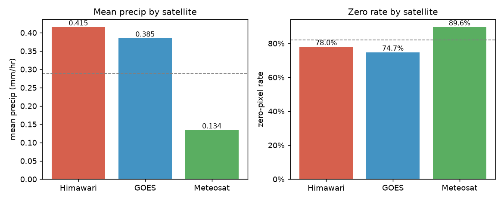
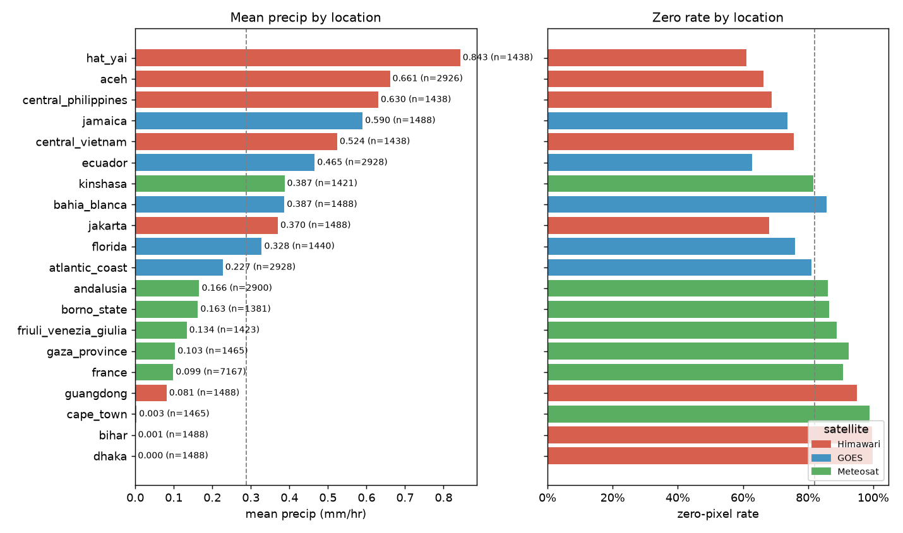
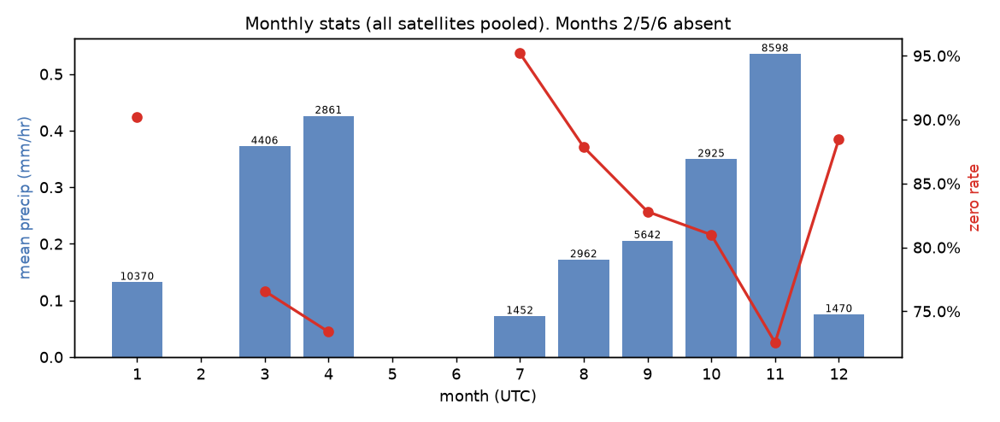
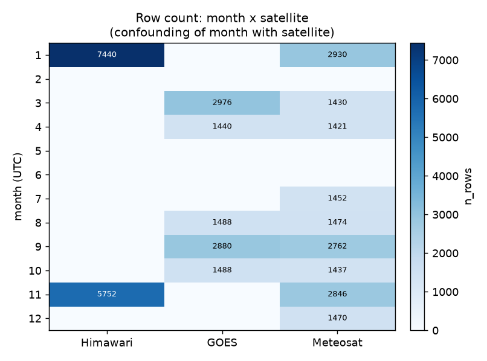
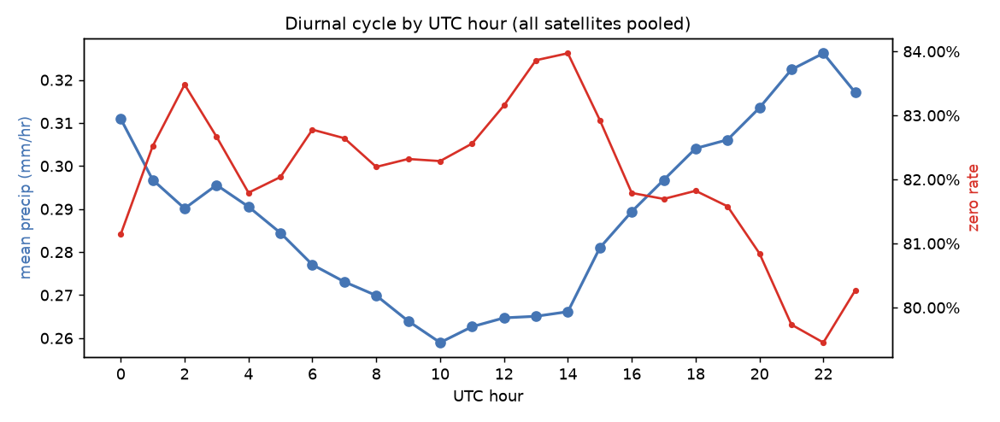

# EDA セクション20 — 層別統計と分布シフト

> 出典データ: `eda_cache/target_stats.parquet`（TRAIN のターゲット GPM-IMERG tif 1ファイル＝1行、計 **40,686 行 / 68,393,166 画素**）。
> 各統計は画素レベル。層別の集計はファイル単位の合計列（`vsum`/`vsq`/`eq0`/`ge*`）を **sum してから sum(npix) で割る**（単純平均ではない）。
> 全0予測の層別 RMSE は `rmse0 = sqrt(sum(vsq)/sum(npix))`、層平均 c で埋めた RMSE は `rmsec = sqrt(sum(vsq)/sum(npix) − c²)`。

本セクションの目的は、**衛星・地域・季節・時刻にまたがる不均衡と分布シフトを定量化**し、それを **サンプル重み付け**と **CV 層化**の設計に落とすこと。ターゲットは強いゼロ過剰（全体でゼロ画素 82.07%）とロングテール（最大 96.5 mm/hr）を持ち、層によってその度合いが大きく異なる。

---

## 0. 全体のベースライン（層別を測る原点）

| 指標 | 値 |
|---|---|
| 行数 / 画素数 | 40,686 / 68,393,166 |
| 画素平均降水 | **0.2886 mm/hr** |
| ゼロ画素率（=0） | **82.07%** |
| <0.1mm 率 | 85.15% |
| ≥1mm 率 / ≥10mm 率 | 6.69% / 0.39% |
| 最大値 | 96.51 mm/hr |
| 全0予測 RMSE | **1.4324** |
| 全画素=平均(c=0.2886) RMSE | **1.4030** |

> 平均で埋めても全0比でわずか 0.029 しか下がらない。**ゼロ過剰ゆえ「全0」が強い基準**であり、改善は「有雨を当てる」ことでしか進まない。以下の層別 RMSE は、各層を全0で埋めたときの誤差＝**その層が持つ難易度（雨の多さ）の代理指標**として読む。

---

## 1. 衛星別（最大の分布シフト軸）

各地域は単一衛星に対応する（地域↔衛星は1対1）。衛星間で雨の量が **約3倍**違う。

| 衛星 | 行数 | 平均降水 | ゼロ率 | ≥1mm | ≥10mm | 最大 | 全0 RMSE | 平均埋め RMSE |
|---|---:|---:|---:|---:|---:|---:|---:|---:|
| Himawari | 13,192 | **0.415** | 77.97% | 9.07% | 0.64% | 96.5 | **1.837** | 1.790 |
| GOES | 10,272 | 0.385 | 74.75% | 9.02% | 0.50% | 79.9 | 1.603 | 1.557 |
| Meteosat | 17,222 | **0.134** | **89.57%** | 3.48% | 0.13% | 87.9 | **0.853** | 0.843 |

**所見**
- **Meteosat は他2衛星と別レジーム**: 平均降水が Himawari/GOES の約 1/3、ゼロ率は 89.6% と突出して乾燥側。全0 RMSE も 0.85 と低い（＝難易度が低い）。
- Himawari と GOES は熱帯・湿潤側で似た分布（平均 0.4 前後、ゼロ率 75〜78%）。
- 行数は Meteosat が最多（17,222、全体の 42%）だが、これは後述の通り **france 1地域**に大きく引っ張られている。
- RMSE が衛星間で 0.85〜1.84 と倍以上開く。**単一の RMSE で評価すると、湿潤衛星（Himawari/GOES）の誤差が支配的**になる。逆に Meteosat の改善は全体 RMSE にほとんど効かない。

---

## 2. 地域別（最も粒度の細かい不均衡）

20 地域。**france が 7,167 行（全体の 17.6%、Meteosat 内の 41.6%）と突出**。一方 borno_state は 1,381 行。雨量レジームは「ほぼ無降水（dhaka/bihar/cape_town）」から「強い熱帯雨（hat_yai 0.843）」まで2〜3桁の幅がある。

| 衛星 | 地域 | 行数 | 平均降水 | ゼロ率 | ≥1mm | ≥10mm | 最大 | 全0 RMSE |
|---|---|---:|---:|---:|---:|---:|---:|---:|
| himawari | hat_yai | 1,438 | **0.843** | 60.98% | 17.80% | 1.40% | 52.7 | **2.601** |
| himawari | aceh | 2,926 | 0.661 | 66.34% | 14.71% | 0.97% | 74.5 | 2.241 |
| himawari | central_philippines | 1,438 | 0.630 | 68.78% | 13.33% | 0.96% | 67.9 | 2.293 |
| goes | jamaica | 1,488 | 0.590 | 73.61% | 10.37% | 1.29% | 79.9 | 2.481 |
| himawari | central_vietnam | 1,438 | 0.524 | 75.51% | 10.10% | 1.15% | **96.5** | 2.509 |
| goes | ecuador | 2,928 | 0.465 | 62.88% | 13.03% | 0.32% | 46.3 | 1.457 |
| meteosat | kinshasa | 1,421 | 0.387 | 81.68% | 8.45% | 0.61% | 51.3 | 1.701 |
| goes | bahia_blanca | 1,488 | 0.387 | 85.72% | 7.73% | 0.82% | 50.8 | 1.773 |
| himawari | jakarta | 1,488 | 0.370 | 67.96% | 9.19% | 0.35% | 49.6 | 1.425 |
| goes | florida | 1,440 | 0.328 | 75.91% | 7.96% | 0.33% | 73.3 | 1.409 |
| goes | atlantic_coast | 2,928 | 0.227 | 81.04% | 5.50% | 0.21% | 51.8 | 1.091 |
| meteosat | andalusia | 2,900 | 0.166 | 86.11% | 4.33% | 0.15% | 66.4 | 0.904 |
| meteosat | borno_state | 1,381 | 0.163 | 86.42% | 4.21% | 0.16% | 37.7 | 0.924 |
| meteosat | friuli_venezia_giulia | 1,423 | 0.134 | 88.84% | 3.70% | 0.13% | 48.4 | 0.805 |
| meteosat | gaza_province | 1,465 | 0.103 | 92.45% | 2.85% | 0.08% | 72.4 | 0.713 |
| meteosat | france | **7,167** | 0.099 | 90.79% | 2.79% | 0.06% | 87.9 | 0.668 |
| himawari | guangdong | 1,488 | 0.081 | 95.09% | 2.46% | 0.02% | 59.4 | 0.563 |
| meteosat | cape_town | 1,465 | 0.003 | 98.95% | 0.09% | 0.00% | 7.0 | 0.072 |
| himawari | bihar | 1,488 | **0.0007** | 99.57% | 0.01% | 0.00% | 5.0 | 0.021 |
| himawari | dhaka | 1,488 | **0.0003** | 99.77% | 0.01% | 0.00% | 3.9 | 0.016 |

**所見**
- **3地域（dhaka/bihar/cape_town）は実質ほぼ無降水**（平均 <0.004、ゼロ率 >98.9%、全0 RMSE <0.073）。これらは学習信号がほぼゼロで、サンプル重みを高くしても得るものが少なく、むしろ「全0が正解」を強化する役割。
- 対照的に **hat_yai/aceh/central_philippines/jamaica** は全0 RMSE が 2.2〜2.6 と高く、**全体 RMSE の大半を生む難所**。≥10mm 率も 1% 超で強雨の裾も厚い。
- **france の 7,167 行は乾燥側（平均 0.099、ゼロ率 90.8%）**。行数で重みを取ると、学習・CV ともに「乾いた1地域」に強く引っ張られる。
- 地域内の雨量レジームは衛星の色分け（赤=Himawari, 青=GOES, 緑=Meteosat）でほぼ層状に分かれる一方、各衛星内でも2桁の地域差がある（例: Himawari 内で dhaka 0.0003 〜 hat_yai 0.843）。**「衛星で説明しきれない地域差」が大きい**＝地域汎化が本質という戦略前提と整合。

---

## 3. 季節（月）別 — ⚠️ 衛星と強く交絡、解釈に注意

| 月(UTC) | 行数 | 平均降水 | ゼロ率 | ≥1mm | 全0 RMSE |
|---:|---:|---:|---:|---:|---:|
| 1 | 10,370 | 0.132 | 90.19% | 3.29% | 0.859 |
| 3 | 4,406 | 0.372 | 76.58% | 9.19% | 1.484 |
| 4 | 2,861 | 0.426 | 73.39% | 10.74% | 1.600 |
| 7 | 1,452 | 0.072 | 95.19% | 2.05% | 0.560 |
| 8 | 2,962 | 0.172 | 87.85% | 4.45% | 0.936 |
| 9 | 5,642 | 0.206 | 82.80% | 5.14% | 1.055 |
| 10 | 2,925 | 0.350 | 80.99% | 6.57% | 1.826 |
| 11 | 8,598 | **0.536** | 72.55% | 11.58% | **2.140** |
| 12 | 1,470 | 0.075 | 88.49% | 2.06% | 0.493 |

**⚠️ 月は衛星・地域とほぼ分離不能に交絡している。** 月別の見かけの季節性は、実際には「その月にどの衛星/地域のデータが入っているか」を反映しているにすぎない。

- **月 2・5・6 はデータが完全に欠落**（全衛星0行）。年も偏在: 2023は1月のみ、2025に大半（25,948行）が集中、2026は1月のみ。
- Himawari は **月1・11 にのみ**出現、GOES は **月3/4/8/9/10**、Meteosat は **月1・3・4・7〜12** に分散。
- 例: 月11 が最も雨が多い（平均 0.536）のは「Himawari の湿潤地域 5,752 行が月11 に集中」しているため。月1 が乾いて見える（0.132）のは「Meteosat と Himawari の乾季地域」で構成されるため。**これは季節効果ではなく標本構成効果**。
- 加えて地域は南北両半球に分散しており（andalusia/friuli=北半球, bahia_blanca/cape_town=南半球）、**暦月をそのまま「季節」として共有することに物理的根拠が薄い**。

→ **結論**: 月単独の層は CV 層化キーとしてもサンプル重みの根拠としても**使わない**。季節性を扱うなら「地域×半球を考慮したローカル季節」か、衛星をコントロールした上での残差として見るべき。

---

## 4. UTC 時刻別（昼夜の代理）

| 観点 | 値 |
|---|---|
| 行数の時刻分布 | 各時刻ほぼ均一（1,676〜1,702行/時） |
| 平均降水の振幅 | 0.259（10時）〜 0.326（22時） UTC |
| ゼロ率の振幅 | 79.45%（22時）〜 83.97%（14時） UTC |
| 全0 RMSE の振幅 | 1.285（10時）〜 1.574（22時） UTC |

**所見**
- 行数は時刻方向にほぼ完全に均等 → **時刻による標本不均衡は無い**。
- 平均降水は緩やかな日変化を示す（振幅 ±12% 程度、22〜23 UTC 付近で最大、10〜14 UTC で最小）。ただし **UTC は3衛星の地理経度が大きく異なるため、各地域のローカル昼夜とは位相がバラバラ**。全衛星合算の UTC 日変化は、地域ごとの対流ピーク（多くは午後〜夕方のローカル時刻）が経度差で平均化された残りであり、振幅は本来より弱められている。
- 昼夜は可視/近赤外バンドの有効性に直結する（夜間は可視が無効）ため、**特徴量・損失マスク設計には重要**。ただし正しく扱うには UTC ではなく **ローカル太陽時（経度 or 太陽天頂角から計算）** を使うべき。本コンペは緯度経度の生メタが提供メタから計算可能（戦略 §2）なので、太陽天頂角を特徴に入れるのが筋。

---

## 5. 設計への落とし込み

### 5.1 サンプル重み付け
- **行数で重みを取ってはいけない**。france(7,167) など乾燥1地域が学習を支配し、難所（hat_yai/aceh/jamaica）が薄まる。RMSE は湿潤地域の二乗誤差で決まるため逆効果。
- 推奨は **逆密度/逆頻度ではなく「誤差寄与」ベース**: 全0 RMSE が高い層（hat_yai 2.60, central_vietnam 2.51, jamaica 2.48, aceh 2.24 …）に学習リソースを寄せる。具体的には (a) 地域ごとに行数を上限クリップして均す、(b) 有雨画素のオーバーサンプル＋無降水画素のダウンサンプル（戦略 §7 と整合）、を併用。
- **ほぼ無降水の3地域（dhaka/bihar/cape_town）はダウンウェイト**してよい（学習信号がほぼ無い）。ただし**評価分布には残す**（Private はこれらも含む全評価データ）。
- 強雨の裾（≥10mm）が厚いのは hat_yai/central_vietnam/jamaica。**逆密度重み（LDS）/重み付き MSE は地域ごとの密度で設計**すると、衛星横断の薄い強雨を取りこぼしにくい。

### 5.2 CV 層化
- **第一キーは地域（name_location）の GroupKFold**。TRAIN20地域とEVAL18地域は完全 disjoint（未知地域汎化が本質）なので、**地域を跨いだ汎化を測る分割でなければ CV が楽観的になる**。
- **fold 間で衛星バランスと雨量レジームを揃える**: 地域を「湿潤(平均>0.4: hat_yai/aceh/central_philippines/jamaica/central_vietnam/ecuador)」「中間(0.1〜0.4)」「ほぼ無降水(<0.01: dhaka/bihar/cape_town)」の層に分け、各 fold に各層と各衛星が混ざるよう **層化 GroupKFold** を組む。france は単独で1 fold を埋めかねない巨大グループなので、必ず1 fold に固定し他と混ぜない（リーク防止＋偏り防止）。
- **時間リーク対策**: 同一地域・近接時刻（10分間隔）の入力が train/val に跨らないよう、地域グループ分割であれば自動的に担保されるが、地域内 hold-out をする場合は日/イベント単位でグループ化する。
- **月は層化キーに使わない**（§3 の交絡）。年も 2025 に偏るため時間分割は地域分割の補助に留める。
- **CV 指標は全体 RMSE に加えて衛星別・地域別 RMSE と強雨条件付き RMSE を併記**: 衛星間で誤差が 0.85〜1.84 と開くため、全体 RMSE は湿潤衛星に支配される。湿潤側が悪化していないかを層別に常時監視する。

### 5.3 評価上の注意
- Public 35% / Private 100%。**TRAIN の層構成（france 突出、月の偏り）が EVAL でも続く保証はない**（地域 disjoint）。手元 CV は「未知地域での挙動」を測ることに振り切り、TRAIN の標本構成に最適化しすぎない。

---

## 付録: 図・数値の再現
- 集計・作図スクリプトはスクラッチ（使い捨て）。図は `docs/eda/figures/strat_*.png`。
- すべて `eda_cache/target_stats.parquet` から再現可能（全体ベースライン値は既確立の事実と完全一致を確認: 平均0.2886 / ゼロ率82.07% / 全0 RMSE 1.4324 / 平均埋め RMSE 1.4030）。
- 図の軸ラベルは英語（実行環境に CJK フォントが無く日本語が文字化けするため）。本文の解説は日本語。
