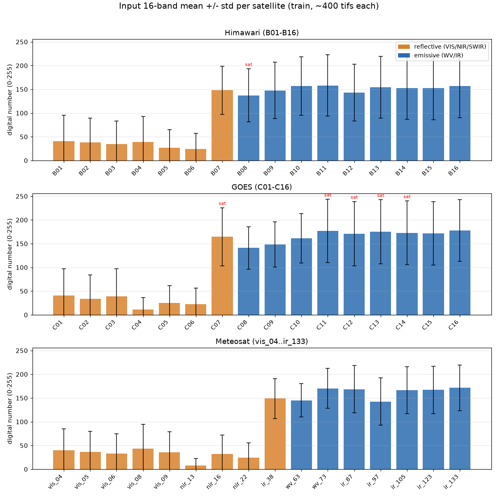

# 40. 入力16バンドの特性

> 産物: `eda_cache/band_stats.parquet`（衛星×バンドの48行）, 図 `eda_cache/fig_bands.png`（=`docs/eda/figures/fig_bands.png`）
> サンプル: train の各衛星から入力 tif を **ランダム400枚**（seed=42）。各バンド256ビンのヒストグラムを積み上げ、平均/分散/分位点を厳密算出。
> 入力 tif は **uint8・16band・CRS無し・identity transform**（[確立済みの事実]と一致）。サイズは himawari 81×81 / goes 141×141 / meteosat 144×144。

---

## 要点（先に結論）

1. **uint8 は実質フルレンジ 0–255 を使う**。48バンド中48本で min=0、28本で max=255 に到達。各バンドの非ゼロビン数は最小でも144/256あり、量子化レンジを広く使い切っている。スケーリング前提でよい（線形 8bit 量子化済みと推定）。
2. **死にバンド（定数・空）は1本も無い**。is_constant / is_empty とも 0 本。16バンドすべてが情報を持つ。
3. **0 は「夜間の反射バンド」または「散在する縁/欠測」であり、グローバルな no-data 番兵ではない**。全16バンド同時に0の画素はほぼ皆無（himawari/meteosat ≈0%, goes 0.15%）。可視バンドの高い0率は **昼夜効果**（夜は反射ゼロ）で、日中だけで見るとほぼ0%（後述）。
4. **3衛星のバンド順は「波長で対応」しない**。並びは衛星ごとに固有（Himawari/GOES は波長昇順、Meteosat は反射群→放射群のまとまり）。チャンネルを横断して使うには **`data-specification.md` の対応表で波長を揃えて並べ替える**必要がある（§後述、確認済み）。
5. バンドは大きく2群に分かれる: **反射系（VIS/NIR/SWIR）= 平均 DN が低く分散大**（雲・地表の反射率、昼のみ）／ **放射系（WV/IR）= 平均 DN 140–180 と高く安定**（輝度温度の単調変換）。降水と直結するのは後者の **赤外窓・水蒸気**。

---

## バンド統計（衛星別サマリ）

DN = digital number（0–255）。値は train ~400枚集計。`frac0`=値0の割合、`frac255`=飽和（値255）の割合。

### Himawari（B01–B16, 各81×81）

| band | 波長μm | 区分 | mean | std | p1 | p50 | p99 | frac0 | frac255 |
|---|---|---|---|---|---|---|---|---|---|
| B01 | 0.47 | VIS | 40.8 | 54.1 | 0 | 1 | 194 | 6.4% | 0% |
| B02 | 0.51 | VIS | 37.9 | 51.3 | 0 | 1 | 188 | 7.2% | 0% |
| B03 | 0.64 | VIS | 34.7 | 48.8 | 1 | 1 | 184 | 0.1% | 0% |
| B04 | 0.86 | NIR | 38.9 | 53.7 | 1 | 2 | 193 | 0.0% | 0% |
| B05 | 1.6 | SWIR | 27.2 | 37.5 | 0 | 1 | 132 | 43.7% | 0% |
| B06 | 2.3 | SWIR | 23.8 | 33.7 | 0 | 1 | 115 | 32.5% | 0% |
| B07 | 3.9 | SWIR-IR | 147.9 | 50.7 | 1 | 161 | 227 | 0.9% | 0% |
| B08 | 6.2 | WV上層 | 137.4 | 55.7 | 0 | 142 | 254 | 1.5% | **1.0%** |
| B09 | 6.9 | WV中層 | 147.8 | 59.0 | 0 | 157 | 250 | 1.5% | 0.3% |
| B10 | 7.3 | WV下層 | 157.1 | 61.7 | 0 | 174 | 246 | 1.5% | 0% |
| B11 | 8.6 | IR | 158.1 | 64.5 | 0 | 179 | 244 | 1.6% | 0% |
| B12 | 9.6 | IR(O₃) | 143.0 | 60.1 | 0 | 160 | 242 | 1.2% | 0% |
| B13 | 10.4 | IR窓 | 154.7 | 65.0 | 0 | 174 | 244 | 1.6% | 0% |
| B14 | 11.2 | IR窓 | 152.6 | 66.1 | 0 | 172 | 242 | 1.7% | 0% |
| B15 | 12.4 | IR窓 | 152.5 | 67.1 | 0 | 173 | 239 | 1.7% | 0% |
| B16 | 13.3 | IR(CO₂) | 156.8 | 66.4 | 0 | 182 | 240 | 1.6% | 0% |

### GOES（C01–C16, 各141×141）

| band | 波長μm | 区分 | mean | std | p1 | p50 | p99 | frac0 | frac255 |
|---|---|---|---|---|---|---|---|---|---|
| C01 | 0.47 | VIS | 40.7 | 56.2 | 0 | 2 | 218 | 48.5% | 0% |
| C02 | 0.64 | VIS | 33.7 | 50.5 | 0 | 2 | 204 | 5.2% | 0% |
| C03 | 0.86 | NIR | 39.0 | 58.3 | 0 | 2 | 215 | 42.9% | 0% |
| C04 | 1.37 | NIR(巻雲) | 11.4 | 25.1 | 0 | 1 | 129 | 35.7% | 0% |
| C05 | 1.6 | NIR | 25.2 | 36.8 | 0 | 1 | 137 | 39.6% | 0% |
| C06 | 2.2 | NIR | 22.6 | 33.5 | 0 | 1 | 118 | 49.6% | 0% |
| C07 | 3.9 | SWIR-IR | 164.6 | 61.0 | 0 | 184 | 253 | 1.2% | 0.5% |
| C08 | 6.2 | WV上層 | 141.0 | 44.8 | 0 | 146 | 228 | 1.3% | 0% |
| C09 | 6.9 | WV中層 | 148.3 | 47.4 | 0 | 157 | 229 | 1.4% | 0% |
| C10 | 7.3 | WV下層 | 161.2 | 52.4 | 0 | 178 | 234 | 1.4% | 0% |
| C11 | 8.4 | IR | 176.8 | 66.8 | 0 | 201 | 254 | 1.5% | **0.7%** |
| C12 | 9.6 | IR(O₃) | 171.1 | 67.6 | 0 | 189 | 255 | 1.2% | **1.0%** |
| C13 | 10.3 | IR窓 | 175.0 | 67.6 | 0 | 199 | 254 | 1.5% | **0.9%** |
| C14 | 11.2 | IR窓 | 172.7 | 67.3 | 0 | 196 | 253 | 1.4% | 0.5% |
| C15 | 12.3 | IR窓 | 171.6 | 66.7 | 0 | 194 | 251 | 1.4% | 0.2% |
| C16 | 13.3 | IR(CO₂) | 177.5 | 65.2 | 0 | 202 | 251 | 1.3% | 0.3% |

### Meteosat（vis_04..ir_133, 各144×144）

| band | 波長μm | 区分 | mean | std | p1 | p50 | p99 | frac0 | frac255 |
|---|---|---|---|---|---|---|---|---|---|
| vis_04 | 0.44 | VIS | 39.5 | 45.8 | 0 | 23 | 170 | 33.6% | 0% |
| vis_05 | 0.51 | VIS | 36.1 | 43.6 | 0 | 19 | 167 | 36.9% | 0% |
| vis_06 | 0.64 | VIS | 32.8 | 42.1 | 0 | 14 | 164 | 41.1% | 0% |
| vis_08 | 0.86 | VIS/NIR | 43.0 | 51.7 | 0 | 15 | 180 | 36.4% | 0% |
| vis_09 | 0.91 | NIR | 35.6 | 43.6 | 0 | 12 | 159 | 32.0% | 0% |
| nir_13 | 1.38 | NIR(巻雲) | 7.8 | 15.2 | 0 | 2 | 74 | 35.7% | 0% |
| nir_16 | 1.61 | NIR | 32.1 | 39.6 | 0 | 9 | 140 | 38.5% | 0% |
| nir_22 | 2.25 | NIR | 24.5 | 31.2 | 0 | 5 | 114 | 32.2% | 0% |
| ir_38 | 3.80 | SWIR-IR | 149.0 | 41.9 | 22 | 154 | 226 | 0.4% | 0% |
| wv_63 | 6.30 | WV上層 | 145.2 | 35.2 | 36 | 148 | 226 | 0.4% | 0% |
| wv_73 | 7.35 | WV中層 | 170.3 | 41.8 | 31 | 180 | 241 | 0.4% | 0.2% |
| ir_87 | 8.70 | IR | 168.7 | 49.7 | 23 | 180 | 240 | 0.4% | 0% |
| ir_97 | 9.66 | IR(O₃) | 142.4 | 49.8 | 17 | 145 | 240 | 0.5% | 0% |
| ir_105 | 10.50 | IR窓 | 166.5 | 49.5 | 22 | 178 | 240 | 0.4% | 0% |
| ir_123 | 12.30 | IR窓 | 167.0 | 50.2 | 22 | 180 | 242 | 0.4% | 0% |
| ir_133 | 13.30 | IR(CO₂) | 171.3 | 48.0 | 25 | 184 | 241 | 0.4% | 0% |

> Meteosat の放射系（ir_*/wv_*）は **p1 が 17–36 と0から離れている**（min=0 は散在する縁/欠測のみ）。Himawari/GOES の放射系は p1=0 だがこれは frac0 が約1.5%あるため。

---

## 0-255か（実効レンジ判定）

- **結論: フルレンジ利用**。48バンド全てで `min=0`、`max` は 28/48 本で 255、残りも 143–253。非ゼロビン数は最小144（≈ 6割以上の量子化階調を使用）。
- これは元の物理量（反射率 0–1 / 輝度温度）を **線形に 8bit へ量子化済み**と整合する。前処理では衛星別・バンド別に `x/255` か、放射系は p1–p99 で標準化するのが素直。**真の物理単位（K, %）への逆変換に必要なゲイン/オフセットは GeoTIFF に入っていない**（CRS も無い）ので、絶対値での物理ベースライン（Tb→RR べき乗則）は **衛星内での相対量としてフィットせざるを得ない**点に注意。

## 死にバンドは（定数・空バンド）

- **無し**。is_constant=0本, is_empty=0本。`nir_13`/`C04`（巻雲 1.38μm）は平均DNが最小（7.8 / 11.4）だが、p99 は 74 / 129 と分布を持ち定数ではない。全16バンドを特徴量に使える。

## 0 の正体（昼夜 vs 欠測）

別検証（各衛星80枚を昼/夜で層別）:

| 衛星 | 可視3band の 0率（昼） | 可視3band の 0率（夜） | 全16band同時0の画素率 | IR後半4band の0率 |
|---|---|---|---|---|
| himawari | 0.0% | 9.0% | 0.000% | 2.0% |
| goes | 1.0% | 60.3% | 0.155% | 3.2% |
| meteosat | 0.0% | 80.5% | 0.012% | 0.2% |

- 可視/近赤外の高い frac0 は **ほぼ全て夜間**（反射光が無くDN=0）。サンプル中、夜（VIS平均<1）の画像が約半数を占めるため、表の frac0 が押し上げられている。
- **0 はグローバル no-data 番兵ではない**（全band同時0は ~0%）。放射系の数%の0は **スキャン端/散在欠測**。
- 実務的含意: **昼夜フラグ（または太陽天頂角）を特徴量に**入れ、夜間は可視/近赤外バンドが死ぬことをモデルに明示する。`[確立済みの事実]` の「入力フレーム0の行235件」とは別に、夜間は反射バンドが情報を持たない点に留意。

## 飽和（値255）

- 全体に軽微（多くが0%）。**GOES の IR 窓 C11/C12/C13/C14 と SWIR C07 で 0.5–1.0%**、Himawari の WV上層 B08 で 1.0%。図中 `sat` 印。
- 放射系の255飽和は **非常に暖かい雲頂/地表＝低い輝度温度ではなく高温側**で起こり得る。降水と相関する「冷たい雲頂」（低DNではなく、放射系では輝度温度が低い＝DNの向きは要確認）への影響は小さいが、**255でクリップされた画素はモデルで頭打ち**になる点を認識しておく。

---

## 3衛星のバンド対応（波長で揃うか）

`docs/dataset/data-specification.md` の対応表と本サンプルの平均DN・区分が整合することを確認した。**バンドの並び順は衛星間で揃っていない**ため、チャンネルを横断して使う場合は下表の波長で並べ替える。

| 観測波長μm | Himawari(idx) | GOES(idx) | Meteosat(idx) | 主用途 |
|---|---|---|---|---|
| ~0.47 | B01(1) | C01(1) | vis_04(1, 0.44) | 可視・エアロゾル |
| ~0.51 | B02(2) | — | vis_05(2) | 可視 |
| ~0.64 | B03(3) | C02(2) | vis_06(3) | 高解像度可視 |
| ~0.86 | B04(4) | C03(3) | vis_08(4) | 植生・近赤外 |
| ~0.91 | — | — | vis_09(5) | 近赤外 |
| ~1.38 | — | C04(4) | nir_13(6) | 巻雲検出 |
| ~1.6 | B05(5) | C05(5) | nir_16(7) | 雪氷・雲相 |
| ~2.2–2.3 | B06(6) | C06(6) | nir_22(8) | 雲粒径・火災 |
| ~3.8–3.9 | B07(7) | C07(7) | ir_38(9) | 下層雲・火災 |
| ~6.2–6.3 | B08(8) | C08(8) | wv_63(10) | 上層水蒸気 |
| ~6.9 | B09(9) | C09(9) | — | 中層水蒸気 |
| ~7.3 | B10(10) | C10(10) | wv_73(11, 7.35) | 中〜下層水蒸気 |
| ~8.4–8.7 | B11(11) | C11(11) | ir_87(12) | 雲相 |
| ~9.6 | B12(12) | C12(12) | ir_97(13) | オゾン |
| ~10.3–10.5 | B13(13) | C13(13) | ir_105(14) | **雲頂温度（赤外窓）** |
| ~11.2 | B14(14) | C14(14) | — | 赤外窓 |
| ~12.3–12.4 | B15(15) | C15(15) | ir_123(15) | ダーティ赤外窓 |
| ~13.3 | B16(16) | C16(16) | ir_133(16) | CO₂・雲頂高度 |

整合の根拠（サンプル平均で確認）:
- **Himawari/GOES は波長昇順**でそのまま対応（B0k↔C0k はほぼ同波長。ただし GOES に 0.51μm が無く、Meteosat に 0.91μm・7.3μmと0.86μmの扱い差があり、idx は1つずつズレる箇所がある）。
- **Meteosat は並びが「反射群（vis_*→nir_*, idx 1–8）→ 放射群（ir_38, wv_*, ir_*, idx 9–16）」**でまとまっており、波長昇順ではない（例: ir_97(9.66μm) が ir_87(8.70μm) の後）。図でも idx 1–8 が低DN、9–16 が高DNと群がはっきり分かれる。
- 衛星固有の欠落: Himawari/GOES は **0.91μm を持たない**、GOES は **0.51μm を持たない**、Meteosat は **6.9μm と11.2μm を持たない**。統一特徴を作る際は **共通する13波長帯**を主軸にし、欠落はマスク/欠損扱いにするのが安全。

> 注意: 波長は衛星ごとに数十nm差があり、上表は近接波長を同じ行に束ねた概略対応。DN→物理量の変換係数は与えられていないため、**衛星横断の絶対整合は取れない**。衛星別に標準化したうえで「同じ波長帯」を同じ特徴スロットに割り当てる方針が現実的（§01 特徴量設計に反映）。

---

## モデリングへの含意（次フェーズ向け）

- **特徴量化**: 衛星別・バンド別に標準化（反射系は /255、放射系は p1–p99 ロバストスケール）。**昼夜フラグ**を必須特徴に。
- **共通スロット**: 上表の波長対応で16→共通スロットへマップ。3衛星統一モデルなら欠落バンドはマスクチャネルを併設。
- **降水の主因子**: 赤外窓（B13/C13/ir_105, 10.4μm 近傍）と水蒸気（6–7μm）が中核。Phase 1 の Tb→RR は **衛星内の相対DN**でフィットし、衛星間はオフセット差を許容する。
- **データ品質**: 死にバンドや定数バンドは無く16本すべて有効。0は欠測番兵ではないので「0→NaN」変換は不要だが、夜間の反射バンド0は意味のある信号（夜）として扱う。
