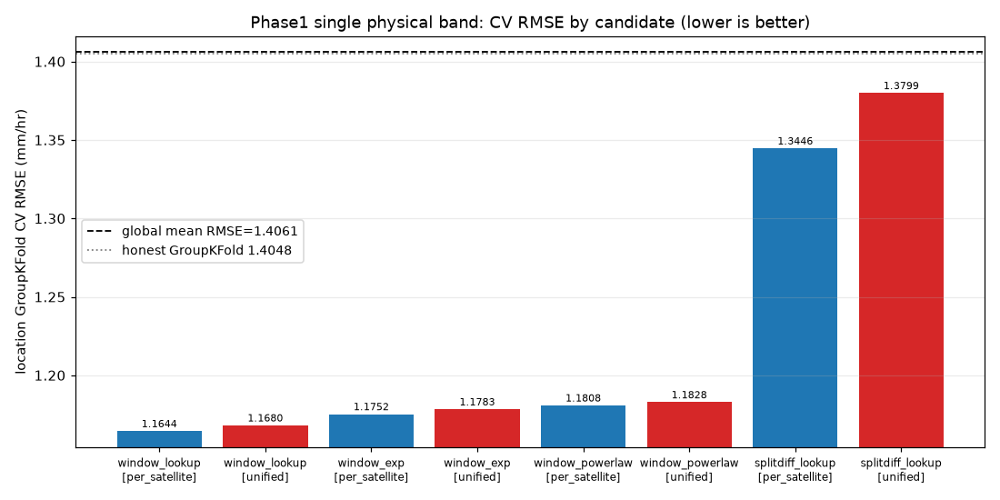
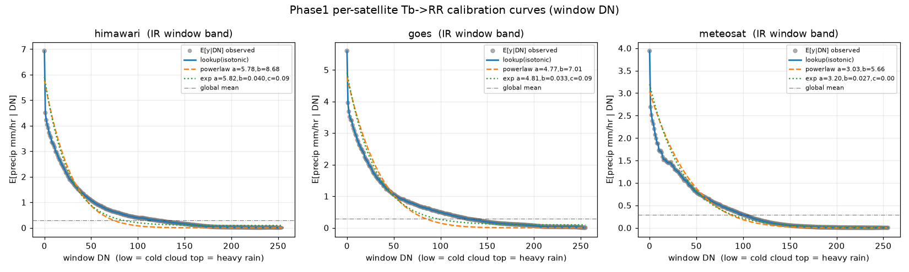

# Phase1 §10 — 物理 Tb→RR 単バンド fit と 地域 GroupKFold CV

> Phase 1（物理ベースライン）の本体。IR 窓 Tb（明るさ温度の代理 = 入力 uint8 DN）
> **単独**の Tb→RR 写像を地域 CV でフィットし、「単バンドでどこまで行くか」の基準を作る。
> 数値はすべて充足統計キャッシュ
> `eda_cache/phase1_window_hist.parquet`（窓 DN ヒストグラム）・
> `eda_cache/phase1_splitdiff_hist.parquet`（split-window 差ヒストグラム）から
> **生データ再読込なし・閉形式**で算出（窓 / split それぞれ 67,996,450 画素 = 約 40,450 行 ×41×41）。
> fit と CV は `src/precip/phase1_fit.py`、実行は scratch。CV 分割は `conf/folds.yaml`（§30 手設計マップ）。

---

## TL;DR（結論）

- **IR 窓 DN 単独で全体平均 1.4061 → 1.1644（−0.2417, −17.2%）まで下がる**。
  最良は **`window_lookup`（条件付き平均 E[y|DN] を isotonic で単調平滑化）× 衛星別 fit**、
  地域 GroupKFold 5fold の画素 RMSE = **1.16437**。honest GroupKFold の全体平均原点 1.4048 を確実に下回る。
- **物理が効く**: 低 DN（冷たい雲頂）ほど高 RR の単調減少を、ノンパラ lookup が最も忠実に拾う。
  パラメトリック（powerlaw / exp）も僅差で追随（1.175〜1.183）し、**「単バンドの天井は約 1.16」**という基準が立った。
- **scope は衛星別が統一を一貫して上回る**（lookup で 1.1644 < 1.1680）。衛星ごとに DN→RR の縮尺が違う
  （DN=0 の平均 RR は himawari 6.9・goes 5.6・meteosat 3.9 mm/hr）ため、衛星別 fit が素直。
- **split-window 差は単独では弱い**（lookup 1.3446）。全体平均はギリ下回るが窓 DN に遠く及ばず、
  LH24 の split-window 知見は**単独特徴ではなく窓 DN への上乗せ（多変量）でこそ効く**と読む。
- **限界は強雨側と乾湿の地域差**。衛星別 CV RMSE は meteosat 0.767（乾燥寄り）< goes 1.288 < himawari 1.451（湿潤・強雨多）。
  単バンドは「降るか降らないか」は当てるが**強雨の絶対値を当てきれない**（条件付き平均への回帰で過小評価）。ここが Phase2 GBDT / CNN の伸びしろ。

---

## (a) 手法

### A-1. 閉形式 CV RMSE（充足統計のみ）

各 (satellite, name_location, bin) で `count=n` / `sum_y=Σy` / `sum_y2=Σy²` を持つ。
任意の写像 `f(bin)→ŷ` の、その bin に属する画素群の二乗誤差和は

```
Σ(y - ŷ)² = sum_y2 - 2·ŷ·sum_y + ŷ²·count
```

なので val 集合全体で総和して画素数で割れば MSE、平方根が RMSE。
**生画素を持たず bin ヒストグラムだけで地域 GroupKFold CV RMSE が厳密に出る**（fold の漏れもない）。
パラメトリック fit も同様で、`Σ_pix(y-ŷ)²` の ŷ 依存部分は `Σ_bin n·(ŷ_bin − mean_bin)²`（mean=Σy/n）の
最小化と同値なので、**残差 = √n·(ŷ_bin − mean_bin)** を最小二乗に与える重み付き fit に帰着する。

### A-2. CV 分割（`conf/folds.yaml`）

主 CV は **地域 GroupKFold 5fold**。分割は §30（`docs/eda/sections/30_grid_and_cv.md` §C-3）の
**衛星×件数×降水強度をバランスした手設計マップ**を正準として `conf/folds.yaml` に固定（seed 非依存・完全再現）。
TRAIN 20 地域すべてを被覆し、各 fold に 3 衛星すべてが train/val 双方に存在する。
`src/precip/cv.py` の seed 依存ラウンドロビン（`make_location_group_kfold`）は使わない。

### A-3. 候補モデル × scope

| model | 写像 | 補足 |
|---|---|---|
| `window_lookup` | f(DN)=学習 fold の E[y|DN] を **isotonic 回帰（DN 増 → RR 単調減）** で平滑化 | スパース bin のノイズ抑制。単バンドの上限性能。未観測 bin は最近傍の観測値で外挿 |
| `window_powerlaw` | RR = a·((255−DN)/255)^b | 充足統計上の画素 MSE 重み付き最小二乗。Auto-Estimator 型 |
| `window_exp` | RR = a·exp(−b·DN) + c | 同上 |
| `splitdiff_lookup` | f(d)=E[y|splitdiff], d = 窓DN − splitDN | LH24 の split-window 知見の検証（isotonic なし） |

- **scope**: `per_satellite`（衛星別 fit）と `unified`（全衛星統一 fit）の両方を評価。
- 全予測は **負値 0 クリップ**（降水は非負）。

---

## (b) CV RMSE 表（地域 GroupKFold 5fold, 画素 RMSE 昇順）

| model | feature | scope | cv_rmse | gain vs 全体平均 |
|---|---|---|---:|---:|
| **window_lookup** | window_dn | **per_satellite** | **1.16437** | **+0.24169** |
| window_lookup | window_dn | unified | 1.16805 | +0.23801 |
| window_exp | window_dn | per_satellite | 1.17523 | +0.23082 |
| window_exp | window_dn | unified | 1.17829 | +0.22777 |
| window_powerlaw | window_dn | per_satellite | 1.18076 | +0.22529 |
| window_powerlaw | window_dn | unified | 1.18279 | +0.22327 |
| splitdiff_lookup | splitdiff | per_satellite | 1.34462 | +0.06143 |
| splitdiff_lookup | splitdiff | unified | 1.37987 | +0.02619 |

> gain は **キャッシュ上の全体平均定数の RMSE = 1.40606** を原点とした差（大きいほど改善）。
> target_stats ベースの honest GroupKFold 全体平均 **1.4048** とほぼ一致（キャッシュは 0フレーム/IO スキップ行を
> 含まないため僅差）。`outputs/phase1_cv_rmse.parquet` に全行を保存。



### 最良モデルの内訳（window_lookup / per_satellite）

衛星別 CV RMSE:

| 衛星 | CV RMSE | 解釈 |
|---|---:|---|
| meteosat | 0.76748 | 乾燥寄り（zero_frac 高）。低 RR が多く誤差小さい |
| goes | 1.28837 | 中間 |
| himawari | 1.45130 | 湿潤・強雨が多く、単バンドでは絶対値を当てきれず誤差大 |

fold 別 CV RMSE: fold0 1.2596 / fold1 1.2046 / **fold2 0.6976** / fold3 1.2593 / fold4 1.3703。
fold2 が低いのは france（7,167 行・乾燥寄り 0.099）が val に入り meteosat が支配的なため（§30 france 問題のとおり）。
**fold 間のばらつきは「地域の乾湿差」がそのまま出ている**もので、分割の異常ではない。

---

## (c) 衛星別キャリブレーション曲線



- 3 衛星とも **E[y|DN] は DN 増加に対し単調減少**（Phase0 で検証した物理と整合）。
  DN=0（最も冷たい雲頂）での平均 RR は himawari ≈6.9・goes ≈5.6・meteosat ≈3.9 mm/hr、
  DN>224 では概ね 0.01 mm/hr 以下に収束する。
- **isotonic lookup（C0 実線）が観測点に最も忠実**で、これが単バンドの上限。
  powerlaw（C1 破線）は低 DN を僅かに過大・中域を過小に寄せ、exp（C2 点線）は中〜高域の裾を拾い切れない。
  曲率が DN 帯で変わるため**単一の解析式では曲線全体を同時に当てにくく**、ノンパラ lookup が勝つ。
- 衛星で縮尺が違う（himawari の DN=0 ピークが最も高い）ため、**衛星別 fit が統一 fit を一貫して上回る**。

---

## (d) 考察 — 単バンドの到達点と限界

- **到達点**: 物理 1 バンド（IR 窓 DN）のノンパラ lookup だけで、honest 原点 1.4048 から
  **約 0.24 mm/hr（−17%）**下がり **CV RMSE 1.164**。地域 GroupKFold（未知地域汎化）での値なので、
  この 1.164 が **Phase2 以降の GBDT / CNN が「最低限超えるべき」基準**になる。
  （参考: LH24 ディスカッションの別 split での IR 系 U-Net holdout val ≈0.87、公式可視 CNN public ≈0.913。
  単バンド物理がそれより数値大なのは当然で、目的は**多変量・空間モデルの上乗せ幅を測る原点作り**。）
- **強雨側の効きと限界**: 低 DN ほど高 RR を当てる物理は明確に効くが、**写像は条件付き平均**なので
  同一 DN 内の RR ばらつき（同じ雲頂温度でも対流の段階で雨量が大きく違う）を平均へ畳んでしまい、
  **強雨ピークを構造的に過小評価**する。himawari の CV RMSE が最も大きい（1.451）のはこのため。
  ここを詰めるには **(i) 窓 DN に時間変化（dTb/dt, 3フレーム min）・近傍空間統計を足す多変量化、
  (ii) split-window 差（雲の厚み/相）や水蒸気バンドの併用、(iii) 損失の強雨重み付け**が筋。
- **split-window 単独は弱い**（1.3446）。これは「split 差が降水と無相関」という意味ではなく、
  **窓 DN ほどの一次情報量を単独では持たない**ということ。LH24 の split-window 知見は
  **窓 DN への第2特徴としての上乗せ**で評価すべき（Phase2 の GBDT 多変量で検証する）。
- **scope の含意**: 衛星別 fit が一貫して勝つ事実は、**3 衛星を 1 モデルに混ぜるなら衛星 ID / 衛星別 head が必須**
  だと示す。統一モデルでも差は小さい（lookup で +0.0037）ので、データが薄い衛星は統一で底上げしつつ
  **衛星埋め込みで縮尺差を吸収**する設計が無難。

---

## 成果物

| パス | 内容 |
|---|---|
| `conf/folds.yaml` | 正準 name_location→fold マップ（§30 手設計・5fold・seed 非依存） |
| `src/precip/phase1_fit.py` | lookup/powerlaw/exp の fit と FoldFit 予測子・閉形式ユーティリティ |
| `outputs/phase1_model.json` | 最良モデル（window_lookup/per_satellite）の確定パラメータ（衛星別 256bin lookup table）。推論器はこれを引く |
| `outputs/phase1_cv_rmse.parquet` | 全候補 × scope の CV RMSE 表 |
| `docs/phase1/figures/calibration_window_dn.png` | 衛星別 E[y|DN] と fit 曲線 |
| `docs/phase1/figures/cv_rmse_bar.png` | 候補別 CV RMSE 棒グラフ |

### 後続フェーズへの引き継ぎ

1. **単バンド基準 = CV RMSE 1.1644（窓 DN lookup / 衛星別）**。Phase2 はこれを超えるかで価値を測る。
2. 確定 lookup は `outputs/phase1_model.json` の `per_satellite[衛星].table[DN]`（負値 0 クリップ済み相当、推論時もクリップ）。
   0フレーム行は `global_mean_fallback=0.2886` を返す（§30 気候値フォールバック方針）。
3. 多変量化の第一候補: 窓 DN + split-window 差 + 時間差分 + 近傍空間統計（GBDT, Phase2）。
4. 強雨過小評価が単バンドの主要誤差源。損失の強雨重み・分位点・2段（降水有無→強度）も検討。
